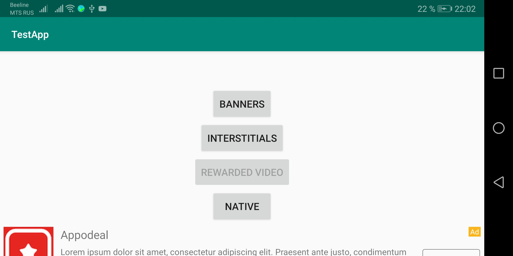
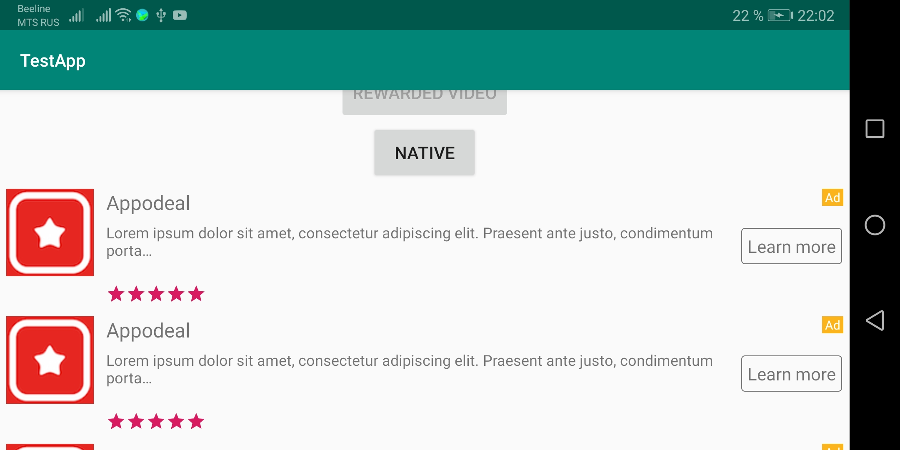
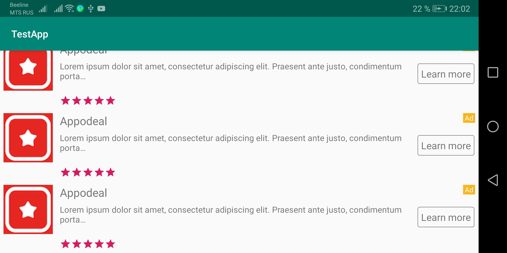
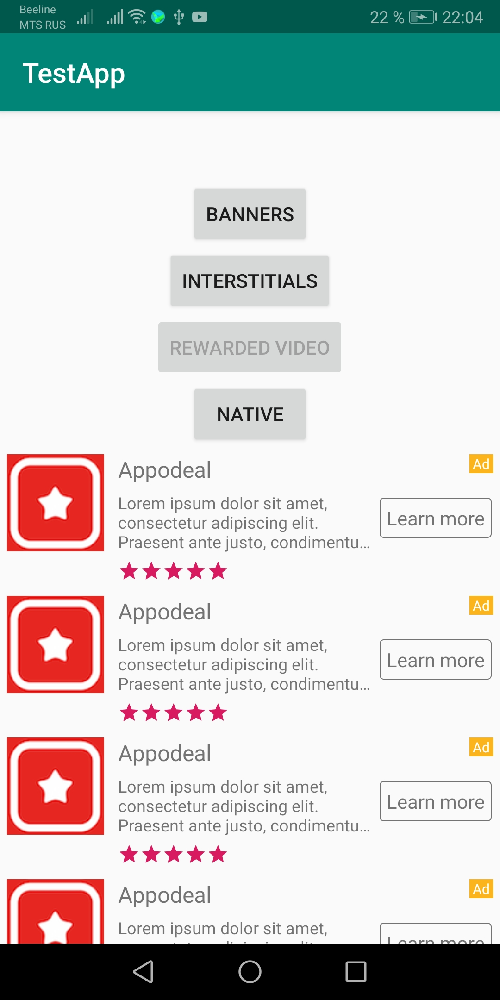
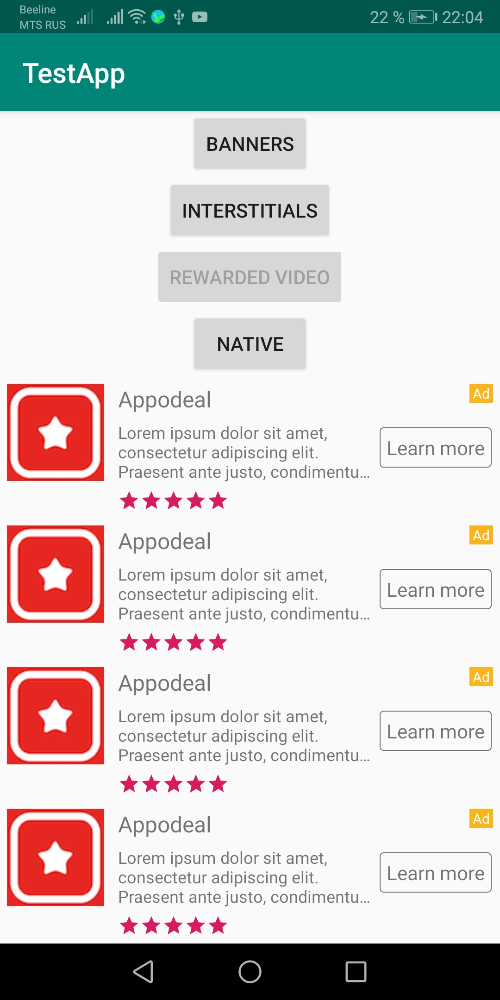

# TestApp2
TestApp версия 2  
APK-файл лежит по пути /app/release/app-release.apk  
### Изменения:
1. Теперь подсчет баннеров идет в момент отображения баннера на экране.
2. Кнопка Rewarded video становится активной через минуту после закрытия видео.
3. Кнопка Rewarded video активна только в том случае, если рекламу можно показать, т.е. если оно загружено и количество показанных видео за награду не более 3.
4. Страница теперь прокручивается.
5. Нативная реклама показывается ниже кнопки Native, причем при её отображении она может поместиться не вся на экране, однако, страница прокручивается, что позволяет просмотреть всю рекламу (показано на скриншотах ниже). Тестировалось на Huawei Honor 7x

Landscape  
 
 
 
  
Portrait  

 
